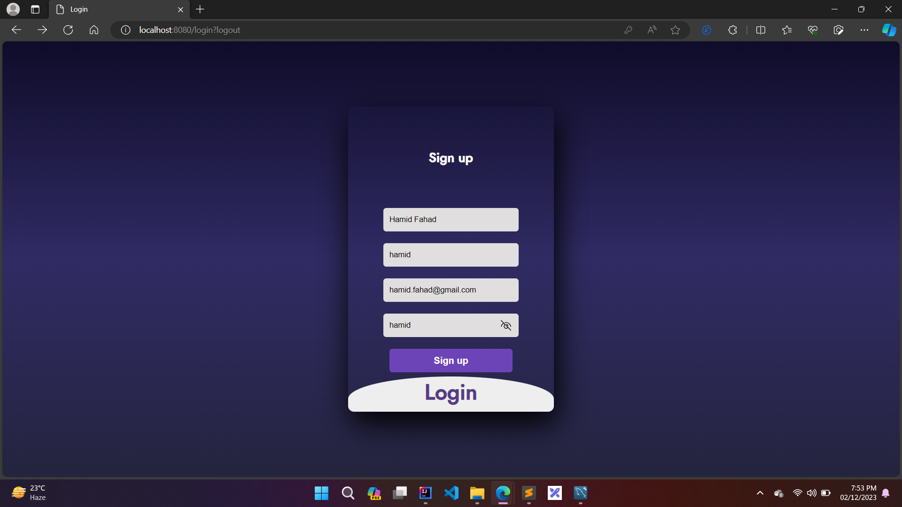
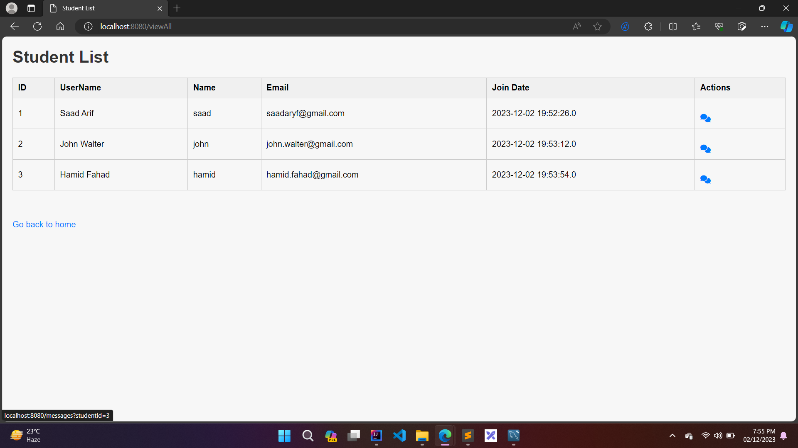
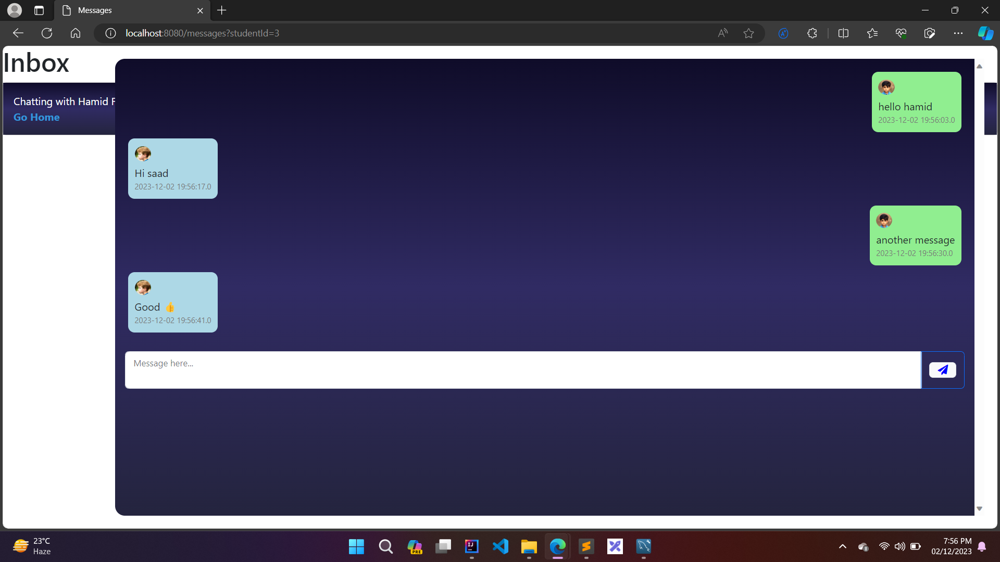

# Scholors-Chat
## How to run 
- Clone Project in IntelliJ IDEA
- Start Apache and MySQL from XAMPP
- Create Database named 'studentsapp'
- Run the project and visit localhost:8080

## Functionalities
- SignUp/Login
- View Porfile
- View Other Users
- Chat with Other Users

## Screenshots

